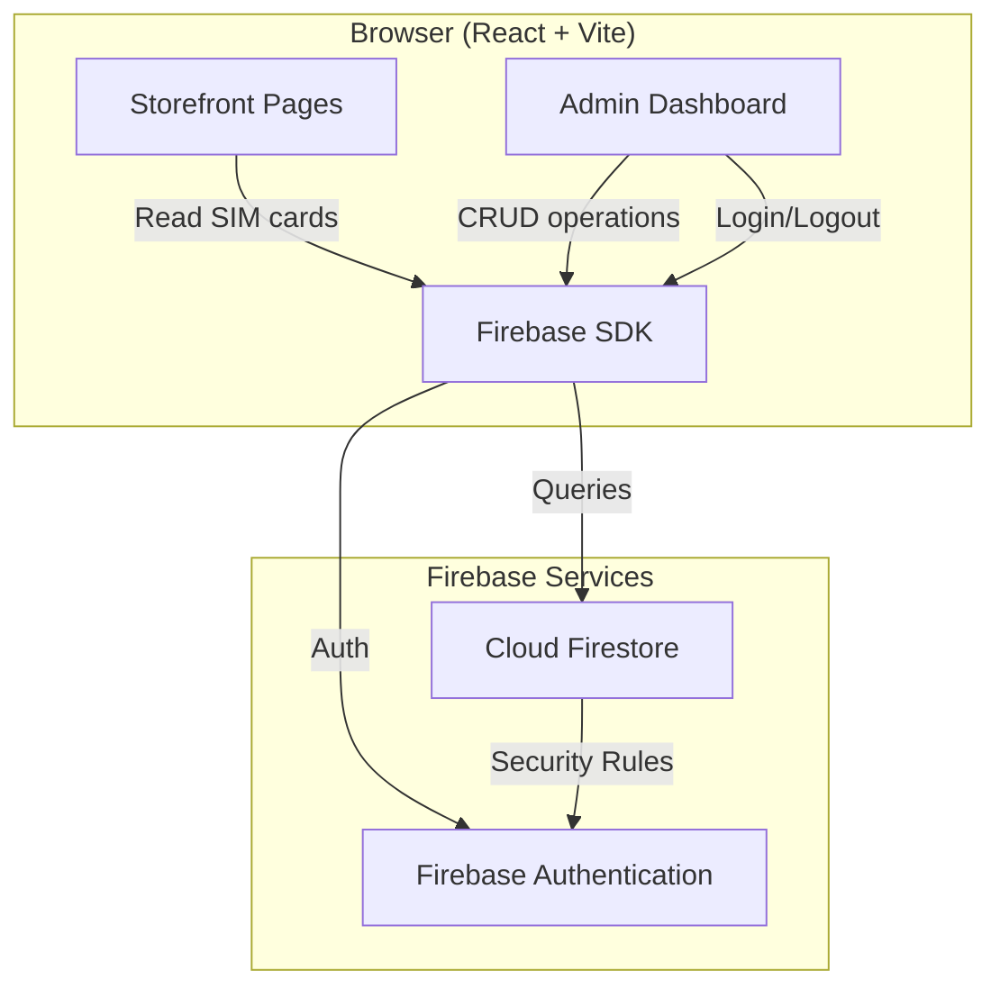

# Design Document: Backend Admin Dashboard

## Overview

This design adds a Firebase backend and admin dashboard to the existing Sim Đệ Nhất React + TypeScript + Vite application. The solution introduces three major subsystems:

1. **Firebase Firestore** as the SIM card data store, replacing the static `src/data/simCards.ts` file
2. **Firebase Authentication** to protect admin-only operations
3. **Admin Dashboard** UI within the same application (accessible at `/admin`) for CRUD operations and bulk upload

The storefront continues to serve customers but fetches live data from Firestore instead of importing hardcoded arrays. The admin dashboard is a route-guarded section that provides the store owner with inventory management tools.

### Key Design Decisions

- **Single application with routing**: The admin dashboard lives in the same Vite app rather than a separate project, reducing deployment complexity and sharing types/utilities.
- **Client-side Firebase SDK**: Both the storefront and admin interact with Firestore directly using the Firebase JS SDK. No custom backend server is needed.
- **Firestore security rules**: Read access is public; write access requires authentication. Validation is enforced both client-side and via Firestore rules.
- **React Router for navigation**: Introduces `react-router-dom` for `/` (storefront) and `/admin` (dashboard) routes.

## Architecture



### Data Flow

1. **Storefront**: App initializes → Firebase SDK connects → Fetches `sim_cards` collection → Renders list with existing filter/sort/search logic
2. **Admin Login**: Owner navigates to `/admin` → Redirected to login if unauthenticated → Enters email/password → Firebase Auth issues token → Dashboard loads
3. **CRUD Operations**: Owner creates/edits/deletes SIM cards → Firebase SDK writes to Firestore → Success/error notification displayed
4. **Bulk Upload**: Owner uploads CSV/JSON file → Client parses and validates → Preview shown → On confirm, batch writes to Firestore

## Components and Interfaces

### New Dependencies

| Package | Purpose |
|---------|---------|
| `firebase` | Firebase JS SDK (Auth, Firestore) |
| `react-router-dom` | Client-side routing |

### Module Structure

```
src/
├── firebase/
│   ├── config.ts              # Firebase app initialization
│   ├── auth.ts                # Auth helper functions
│   └── simCards.ts            # Firestore CRUD operations for SIM cards
├── admin/
│   ├── AdminLayout.tsx        # Admin shell with navigation and auth guard
│   ├── LoginPage.tsx          # Email/password login form
│   ├── SimCardTable.tsx       # Table view of all SIM cards
│   ├── SimCardForm.tsx        # Add/Edit form with validation
│   ├── BulkUpload.tsx         # File upload, parse, preview, confirm
│   └── AdminNotification.tsx  # Success/error toast notifications
├── hooks/
│   ├── useAuth.ts             # Auth state hook (current user, loading)
│   └── useSimCards.ts         # Firestore subscription hook for SIM cards
├── context/
│   └── AuthContext.tsx        # Auth state provider
├── utils/
│   ├── validators.ts          # SIM card field validation logic
│   └── bulkParser.ts          # CSV/JSON file parsing logic
```

### Key Interfaces

```typescript
// firebase/config.ts
export function initializeFirebaseApp(): FirebaseApp;
export function getFirestoreDb(): Firestore;
export function getFirebaseAuth(): Auth;

// firebase/auth.ts
export function loginWithEmail(email: string, password: string): Promise<UserCredential>;
export function logout(): Promise<void>;

// firebase/simCards.ts
export function fetchAllSimCards(): Promise<SimCard[]>;
export function createSimCard(data: SimCardInput): Promise<string>; // returns doc ID
export function updateSimCard(id: string, data: Partial<SimCardInput>): Promise<void>;
export function deleteSimCard(id: string): Promise<void>;
export function bulkCreateSimCards(cards: SimCardInput[]): Promise<BulkResult>;

// utils/validators.ts
export function validateSimCard(data: unknown): ValidationResult;
export function validateCarrier(carrier: string): boolean;
export function validateCategory(category: string): boolean;

// utils/bulkParser.ts
export function parseCSV(content: string): ParseResult<SimCardInput>;
export function parseJSON(content: string): ParseResult<SimCardInput>;
```

### Type Definitions

```typescript
// Extended SimCard type for Firestore
interface SimCardDocument {
  id: string;
  number: string;
  carrier: 'Viettel' | 'Mobifone' | 'Vinaphone';
  category: 'Phong Thủy' | 'Lộc Phát' | 'Thần Tài' | 'Số Đẹp' | 'Giá Rẻ';
  price: number;
  description?: string;
  createdAt: Timestamp;
}

// Input type for creating/updating (no id or createdAt)
interface SimCardInput {
  number: string;
  carrier: string;
  category: string;
  price: number;
  description?: string;
}

// Validation result
interface ValidationResult {
  valid: boolean;
  errors: Record<string, string>; // field -> error message
}

// Bulk operation results
interface BulkResult {
  successCount: number;
  failedCount: number;
  failures: { index: number; errors: Record<string, string> }[];
}

// File parsing result
interface ParseResult<T> {
  success: boolean;
  data: T[];
  errors: { row: number; message: string }[];
}
```

### Component Responsibilities

| Component | Responsibility |
|-----------|---------------|
| `AdminLayout` | Wraps admin routes, checks auth state, redirects to login if unauthenticated |
| `LoginPage` | Email/password form, calls `loginWithEmail`, shows error on failure |
| `SimCardTable` | Fetches all SIM cards, displays in table, supports filter/search, delete action |
| `SimCardForm` | Controlled form with dropdowns for carrier/category, validates before submit |
| `BulkUpload` | File input accepting `.csv`/`.json`, parses content, shows preview table, confirms upload |
| `AdminNotification` | Toast component for CRUD operation success/error feedback |

### Routing Configuration

```typescript
// App.tsx routing structure
<Routes>
  <Route path="/" element={<StorefrontLayout />} />
  <Route path="/admin/login" element={<LoginPage />} />
  <Route path="/admin/*" element={<AdminLayout />}>
    <Route index element={<SimCardTable />} />
    <Route path="add" element={<SimCardForm />} />
    <Route path="edit/:id" element={<SimCardForm />} />
    <Route path="bulk-upload" element={<BulkUpload />} />
  </Route>
</Routes>
```

## Data Models

### Firestore Collection: `sim_cards`

| Field | Type | Required | Description |
|-------|------|----------|-------------|
| `number` | string | Yes | Phone number (e.g., "0986 888 666") |
| `carrier` | string | Yes | One of: Viettel, Mobifone, Vinaphone |
| `category` | string | Yes | One of: Phong Thủy, Lộc Phát, Thần Tài, Số Đẹp, Giá Rẻ |
| `price` | number | Yes | Price in VND (must be > 0) |
| `description` | string | No | Optional description text |
| `createdAt` | timestamp | Yes | Auto-generated on creation |

The Firestore document ID serves as the `id` field used in the application.

### Firestore Security Rules

```
rules_version = '2';
service cloud.firestore {
  match /databases/{database}/documents {
    match /sim_cards/{simCardId} {
      // Anyone can read SIM cards (public storefront)
      allow read: if true;
      
      // Only authenticated users can write
      allow write: if request.auth != null;
    }
  }
}
```

### Data Migration

The existing hardcoded data in `src/data/simCards.ts` will be migrated to Firestore as a one-time seed operation. A migration script or the bulk upload feature can be used for this purpose. After migration, the `src/data/simCards.ts` file is removed.


## Correctness Properties

*A property is a characteristic or behavior that should hold true across all valid executions of a system—essentially, a formal statement about what the system should do. Properties serve as the bridge between human-readable specifications and machine-verifiable correctness guarantees.*

### Property 1: Document creation preserves all input fields

*For any* valid SimCardInput (with valid number, carrier, category, and price), creating a document should produce a SimCardDocument that contains all original input fields unchanged, plus auto-generated `id` (non-empty string) and `createdAt` (valid timestamp).

**Validates: Requirements 1.1, 4.1**

### Property 2: Enum validation rejects invalid values

*For any* string that is not one of the allowed carrier values ("Viettel", "Mobifone", "Vinaphone") or allowed category values ("Phong Thủy", "Lộc Phát", "Thần Tài", "Số Đẹp", "Giá Rẻ"), the respective validation function shall return false. Conversely, for any allowed value, it shall return true.

**Validates: Requirements 1.2, 1.3**

### Property 3: Firestore document to SimCard mapping

*For any* valid Firestore document containing the fields (id, number, carrier, category, price, description, createdAt), mapping it to the application SimCard type should produce an object with matching id, number, carrier, category, price, and description fields.

**Validates: Requirements 2.3**

### Property 4: Input validation detects all invalid fields

*For any* SimCardInput object where one or more required fields are missing or contain invalid values (invalid carrier string, invalid category string, non-positive price, empty number), `validateSimCard` shall return `valid: false` with error entries for exactly the fields that are invalid, and no errors for valid fields.

**Validates: Requirements 4.5, 4.6**

### Property 5: CSV/JSON parsing round-trip

*For any* array of valid SimCardInput records, serializing them to CSV format and parsing back with `parseCSV` (or serializing to JSON and parsing with `parseJSON`) should produce an equivalent array of SimCardInput objects.

**Validates: Requirements 5.1**

### Property 6: Bulk validation correctly partitions records

*For any* array containing a mix of valid and invalid SimCardInput records, bulk validation shall correctly classify each record: all valid records are in the success set, all invalid records are in the failure set with their correct indices and error details, and no record appears in both sets.

**Validates: Requirements 5.3**

### Property 7: Admin search filtering returns only matching records

*For any* set of SIM card records and any search query string, the filtered result shall contain only records where the number, carrier, or category contains the search query (case-insensitive), and shall contain all such matching records from the original set.

**Validates: Requirements 7.6**

## Error Handling

### Firestore Errors (Storefront)

| Error Scenario | Handling |
|----------------|----------|
| Network unreachable | Display user-friendly error message with retry option |
| Permission denied | Should not occur for reads (public), log and show generic error |
| Document parse error | Skip malformed documents, log warning |

### Authentication Errors (Admin)

| Error Scenario | Handling |
|----------------|----------|
| Invalid credentials | Display "Invalid email or password" message on login form |
| Session expired | Redirect to login page with "Session expired" message |
| Network error during auth | Display "Unable to connect" with retry option |

### CRUD Operation Errors (Admin)

| Error Scenario | Handling |
|----------------|----------|
| Validation failure | Display field-specific error messages, prevent submission |
| Write permission denied | Display error notification, suggest re-login |
| Network error during write | Display error notification with retry option |
| Concurrent modification | Firestore handles via last-write-wins; display success |

### Bulk Upload Errors

| Error Scenario | Handling |
|----------------|----------|
| File format unrecognized | Display "Please upload a .csv or .json file" |
| Parse failure (malformed CSV/JSON) | Display parse error with line/row information |
| Partial validation failure | Show preview with valid/invalid rows highlighted, allow proceeding with valid only |
| Batch write partial failure | Report success count and failed records with reasons |

## Testing Strategy

### Property-Based Testing

This feature contains pure logic functions (validation, parsing, filtering) well-suited for property-based testing. We will use **fast-check** as the property-based testing library for TypeScript.

**Configuration:**
- Minimum 100 iterations per property test
- Each test tagged with: `Feature: backend-admin-dashboard, Property {N}: {description}`

**Properties to implement:**
1. Document creation preserves all input fields
2. Enum validation rejects invalid values
3. Firestore document to SimCard mapping
4. Input validation detects all invalid fields
5. CSV/JSON parsing round-trip
6. Bulk validation correctly partitions records
7. Admin search filtering returns only matching records

### Unit Tests (Example-Based)

- Login form behavior (redirect on unauthenticated access, successful login flow)
- Logout flow (session end, redirect to login)
- Loading indicator display during data fetch
- Error message display on fetch failure
- Table rendering with correct columns
- Form dropdown selectors for carrier/category
- Notification display after CRUD operations
- File upload UI accepts correct formats
- Preview display before bulk upload confirmation
- Route accessibility (`/admin` renders dashboard)

### Integration Tests

- Firebase Auth emulator: login/logout flows
- Firestore emulator: CRUD operations persist and read back correctly
- Security rules: unauthenticated writes rejected, authenticated writes accepted
- Storefront + Admin share same Firestore collection

### Test Framework

- **Vitest** for unit and property tests (aligns with Vite toolchain)
- **fast-check** for property-based test generation
- **@testing-library/react** for component testing
- **Firebase Emulator Suite** for integration tests
